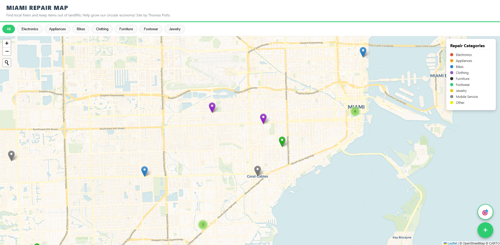

# Miami Repair Map

**Live site:** [tommypotts.github.io/miami-repair-map](https://tommypotts.github.io/miami-repair-map/)

## Overview

An interactive, crowdsourced map of repair businesses across Miami-Dade County — built as a proof-of-concept tool for [Zero Waste Miami](https://zerowastemiami.org/) to demonstrate how a public-facing resource hub could help residents find local fixers and keep repairable items out of landfills.

This project was developed as part of an environmental justice practicum (ECS 372) at the University of Miami, in partnership with Zero Waste Miami. It is a working prototype, not the organization's official platform.

## Why Repair?

Miami-Dade County generates waste at nearly double the national average: 4.9 lbs per person per day. Textiles, appliances, and jewelry alone account for roughly 20% of the county's garbage stream, yet much of it is repairable. The problem is that repair services in Miami-Dade are fragmented and hard to find: wealthier areas like Coral Gables and Brickell have high-quality repair options, while neighborhoods in South Dade and North Miami are underserved.

This map addresses that gap by aggregating repair businesses into a single searchable interface and allowing community members to contribute new listings.

## Features

- **Interactive Leaflet map** with color-coded markers by repair category (electronics, appliances, bikes, clothing, furniture, footwear, jewelry)
- **Category filtering** to find specific repair types
- **Marker clustering** for readability at low zoom levels
- **Address search** via geocoder for neighborhood-level navigation
- **User geolocation** ("find me") for proximity-based browsing
- **Crowdsourced submissions** — anyone can add a repair shop via the built-in form
- **Moderated approval workflow** — submissions go to a Supabase backend and must be approved before appearing on the map, preventing spam and inaccurate listings
- **Google Maps directions** — one-tap routing from any shop popup
- **Dark mode** with persistent theme preference
- **Mobile responsive** layout

## Tech Stack

| Layer | Technology |
|-------|-----------|
| Map | Leaflet.js, leaflet.markercluster |
| Geocoding | Leaflet Control Geocoder (Nominatim / OpenStreetMap) |
| Backend | Supabase (PostgreSQL with Row Level Security) |
| Hosting | GitHub Pages |
| Frontend | Vanilla HTML, CSS, JavaScript |

## Project Context

This map is one component of a broader initiative developed for Zero Waste Miami's circular economy goals. The full project also includes:

- **Repair fair planning** — proposals for integrating repair services into existing community events like farmers' markets and public school programs
- **Community fridge analysis** — GIS-based spatial analysis of food desert coverage gaps and community fridge placement using census poverty data, vehicle access rates, and USDA food access data
- **Workforce development pathways** — connecting repair trades to apprenticeship programs through Miami-Dade College and CareerSource South Florida

The repair map specifically addresses the finding that Miami-Dade's repair economy is isolated and fragmented, with no centralized resource for residents to discover local repair options.

## How It Works

1. Approved repair businesses are stored in a Supabase PostgreSQL database
2. On page load, the app queries for all approved listings and renders them as map markers
3. Users can filter by category, search by address, or use geolocation
4. New submissions are geocoded via Nominatim and inserted with `is_approved: false`
5. An administrator reviews and approves submissions through the Supabase dashboard

## Local Development

```bash
# Clone the repo
git clone https://github.com/tommypotts/miami-repair-map.git
cd miami-repair-map

# Open in browser (no build step needed)
open index.html
```

No dependencies to install: the app uses CDN-hosted libraries and connects directly to Supabase.

## Author

**Thomas Potts**  
University of Miami — Ecosystem Science & Policy, Marine Affairs, Computer Science  
Built for ECS 372: Special Topics in Ecosystem Science & Policy (Spring 2026)
